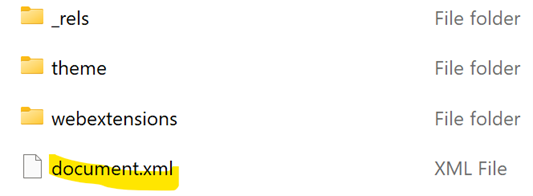
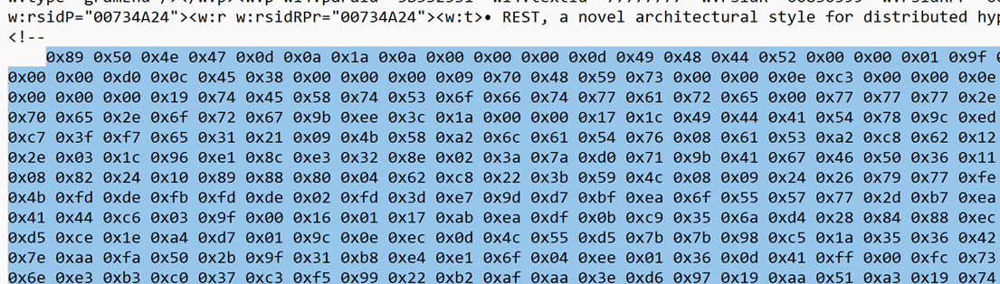

# Documented Flag

### Challenge
The image in the document displays the flag

Opened the Miscroft Word document and looked for an image but not was present.  Microsoft .docx files are actually just zip files so renamed from rest.docx to rest.zip.  Sometimes they have a media folder with image files, but this had a document.xml file.  

Opened that file and noticed some commented out hex values

Used [CyberChef](https://gchq.github.io/CyberChef/) and pasted the hex content in the input, dragged over the "from Hex" into the recipe area, then in output area saw it was a PNG file so clicked on the save  

Opened the saved .png file and saw the flag

