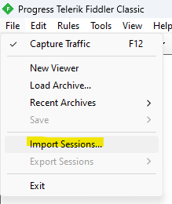
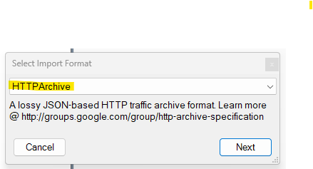
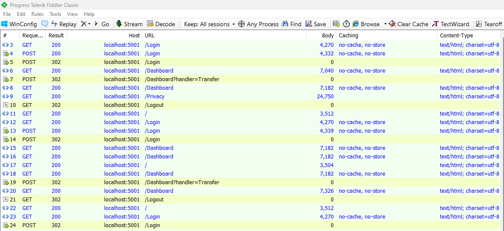
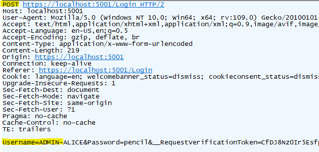
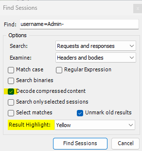
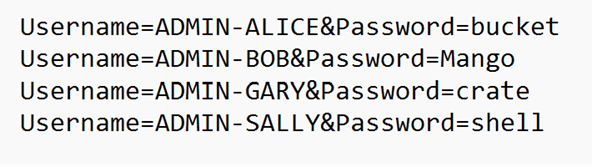

# Hardy, har, har

### Challenge
Security is no laughing matter.  This flag is the passwords of all the admin users of Budget Bank, in alphabetical order, and case sensitive.

A .har file is often captured in browser developer tools in the Network panel.  I first importated the file into Fiddler Classic

Choose the HTTP Archive type

Review the sessions (requests) captured and saw a POST for /login

Click on one of the requests and view in the Inspectors in the request information and see that the POST body has username=Admin- prefix followed by name of an admin

Used the Edit->Find Sessions menu item, make sure to check "Decode Compress Content" (so it can search inside compress response files) and search for "username=Admin-"

Click on each request looking for unique admin names, ends up being this

Put passwords in alphabetical order and add dashes for the flag
