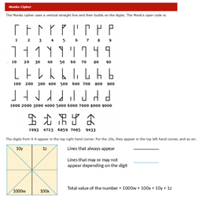
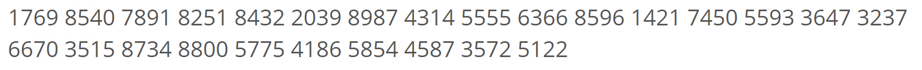
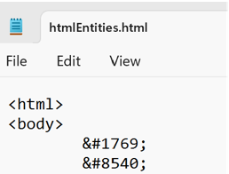
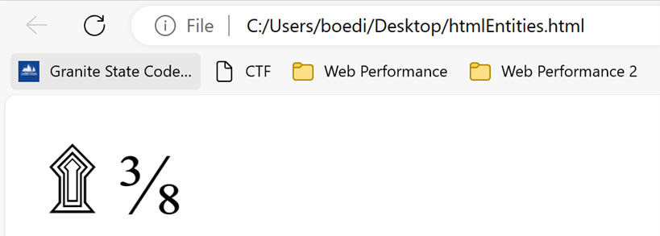

# Monky Business

### Challenge
TIP: there are no '-'s in this flag

Noticed the odd spelling of what would have been Monkey Business.  Searched for a Monk cipher and found this [Monk Cipher](https://asecuritysite.com/challenges/monk)

Used the instructions to manually figure out each of the symbols decimal value

Needed to convert those somehow to letters or symbols so tried using many conversions, eventually remembered [HTML Entities](https://www.w3schools.com/html/html_entities.asp) and created a .html file with the values

The symbols looked plausible, they were indeed the flag

