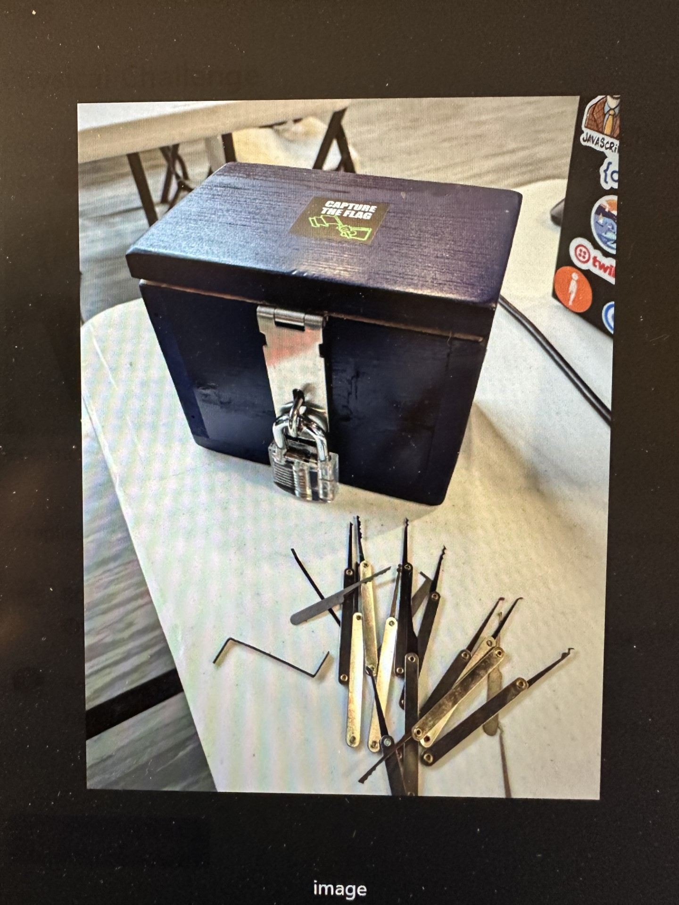

# Physical Challenge

### Challenge
You must be on-premise to unlock this flag.  Visit the registration table for details.  (Good luck Boedie...)

This type of challenge is to give an advantage to people physically attending the code camp.  Last year Bob thought I would have troubles but I was able to deal with 
that [2022 Physical Challenge](https://github.com/crowleysoftware/GSCC2022_CTF_Solutions/tree/main/RobertBoedigheimer/PhysicalChallenge) which my daughter helped me with.  This
year he wanted it to be really hard for remote attendees (he even called me out by name in challenge).  I wasn't sure what to expect so I reached out to some people I knew in New Hampshire hoping they would stop by and
find the clue.  I even looked into Task Rabbit services.  Ultimately the day of this was the challenge

I actually do lockpicking as a hobby and would have been able to make quick work of getting into that box.  I finally enlisted some help from someone who was physically 
present and knew how to pick locks.  She got me the flag!  What's Bob going to have to do next year??
