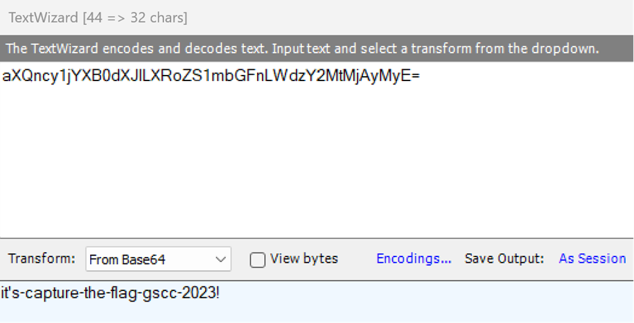

# Welcome Challenge

### Challenge

> aXQncy1jYXB0dXJlLXRoZS1mbGFnLWdzY2MtMjAyMyE=

Encoding is often used in CTF challenges, ending in "=" or "==" often indicates it was encoded using base64.  Used Fiddler Classic "TextWizard" and pasted string then used "from base64" to decode and get the flag.

